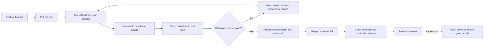

# Simple Google Cloud CI/CD for UGV firmware

## Recommendation in brief

Use Cloud Build for repeatable compilation and software tests, Artifact Registry for immutable firmware bundles, and the pull request as the manual hardware approval gate.

For this project, `dev`, `preprod`, and `prod` should be **states of one firmware artifact**, not three long-lived cloud environments:

| Stage | Meaning | Gate to leave the stage |
| --- | --- | --- |
| Dev / CI | A pull request commit compiles and its fast tests pass in Cloud Build | Cloud Build succeeds |
| Preprod / candidate | The exact CI-built binary is flashed to a designated test rover | A recorded hardware checklist passes |
| Prod / released | The tested binary is approved as a known-good release | PR is merged and a release record points to that exact artifact |

Do not rebuild the firmware between preprod and prod. Promote the exact bytes that were tested.

This is deliberately a small **CI plus manual delivery** workflow. Fully automated deployment to moving hardware adds safety, connectivity, and recovery problems that are not justified initially.

## What is correct in the proposed approach

- Building and running simple tests in Google Cloud Build is appropriate.
- A physical rover is a valid preproduction environment. Hardware behavior cannot be proved by cloud-only tests.
- Promotion should happen only after hardware validation.
- Keeping old build artifacts makes rollback substantially easier.
- Protecting `main` from untested changes is sensible while one physical rover is the main test target.

The important adjustment is that Cloud Build cannot directly access a rover connected by USB on a local network. Google Cloud's workers run remotely. Preprod therefore needs either:

1. a person who downloads and flashes the candidate, which is recommended first; or
2. a separately maintained agent on a Raspberry Pi or workstation attached to a dedicated test rover.

Also, a Cloud Build trigger approval pauses a build **before it starts**. It is useful for controlling a release job, but it does not naturally pause a completed CI build while someone tests its artifact. Use the PR review/checklist as the first hardware gate rather than trying to keep one Cloud Build execution open.

## Proposed workflow



### 1. Develop on a branch

- Create a short-lived branch for the firmware change.
- Open a pull request into `main`.
- Do not commit generated files from `General_Driver/build/` as release storage. Cloud-generated artifacts are the source of release binaries.

### 2. Run CI for every pull request commit

Connect the GitHub repository to Cloud Build and configure a pull-request trigger for a checked-in `cloudbuild.yaml`.

The build should:

1. install a pinned Arduino CLI version;
2. install a pinned ESP32 Arduino core version;
3. install pinned versions of every external Arduino library;
4. make the repository's `SCServo` library available to the build;
5. run host-side unit tests;
6. compile `General_Driver/General_Driver.ino` for the exact ESP32 board profile;
7. package all files and flashing metadata needed to restore the device;
8. calculate a SHA-256 checksum; and
9. upload the bundle to an Artifact Registry generic repository using the Git commit SHA as the version.

Artifact Registry generic versions cannot be overwritten. That makes a commit SHA a useful immutable candidate identifier, for example:

```text
package: ugv-general-driver
version: <full-git-commit-sha>
files:
  firmware.bin or merged-firmware.bin
  bootloader.bin
  partitions.bin
  flash-command.txt
  manifest.json
  SHA256SUMS
```

The exact file set and flash offsets must come from the pinned Arduino build configuration. Do not guess them. A merged flash image is convenient if the chosen ESP32 toolchain can generate one reproducibly.

### 3. Perform the preprod hardware test

Download the candidate identified by the current PR commit. Verify its checksum, place the rover on a stand or in a controlled test area, and flash that artifact without recompiling locally.

Record at least:

- PR number and Git commit SHA;
- artifact package/version and SHA-256 digest;
- rover/controller identity and hardware configuration;
- previous known-good firmware version;
- test date and tester;
- pass/fail results and attached logs where useful.

For the current telemetry work, a minimal checklist could be:

- device boots without reset loops;
- emergency stop or motor-disable behavior works;
- UART accepts a harmless command and returns valid JSON;
- `T=130` produces valid `T=1001` telemetry;
- the measured telemetry cadence meets the agreed acceptance criteria;
- pan/tilt movement and feedback agree within an acceptable tolerance;
- no recurring servo feedback failure diagnostic appears;
- Wi-Fi/web behavior still works if the change can affect it;
- a power cycle preserves expected operation.

If any check fails, do not merge. Reflash the previous known-good artifact, add a corrective commit, and let CI create a new candidate. Any new commit invalidates the earlier hardware approval.

### 4. Promote and merge

After the exact candidate passes:

1. record the result in the PR using a small checklist or test report;
2. require the CI check and hardware approval before merge;
3. ensure the branch has not changed since the tested artifact was built;
4. merge the PR without making additional content changes; and
5. create a release tag such as `firmware-v0.96.0` plus a release manifest that maps the release to the tested candidate commit and digest.

The release action should **reference or copy the already tested bytes**, then verify their SHA-256 digest. It should not compile a fresh binary and call that binary production.

For a one-person project, the hardware approval can initially be a checked PR box with the candidate digest in a comment. Later, a required GitHub status check or a small approval service can formalize it.

## Rollback design

Rollback means flashing a previously released binary, not reverting source and rebuilding under whatever tool versions happen to be installed later.

Keep at least:

- the current production bundle;
- the previous known-good bundle;
- their checksums and flash commands;
- any required device configuration backup; and
- a short release/test record.

Before every hardware test, confirm that the previous bundle is downloaded and can be flashed. If the candidate prevents normal USB flashing, use the ESP32 bootloader/recovery procedure and the stored full flash command.

Source rollback is separate. A Git revert can restore code history, but it may not reproduce an old binary unless the complete toolchain is pinned. The archived binary is the fastest operational rollback; the source revert is the follow-up repository change.

ESP32 dual-partition OTA with automatic rollback could eventually improve recovery. It requires an OTA partition layout, image validation, device authentication, and a recovery design. None of that should be assumed from the current repository, so it is a later phase rather than the first pipeline.

## Very simple unit tests

Cloud tests cannot prove that motors, UART wiring, servo timing, or sensors work. They are still valuable for deterministic logic that can be separated from Arduino hardware calls.

Good first targets are:

- angle and encoder conversions;
- command range clamping;
- JSON command validation and dispatch decisions;
- feedback interval/gate calculations;
- timeout and wraparound calculations using unsigned timestamps; and
- pure pan/tilt mapping logic.

Compile these as native C++ tests with a small framework such as Unity, or use PlatformIO's native test environment if the project adopts PlatformIO. Keep hardware register access and Arduino globals behind narrow interfaces so the tests remain fast.

The first CI version can be useful even with only a few tests: a reproducible firmware compile is itself an important check. Do not create tests that merely duplicate implementation details to increase a test count.

## Required repository work before Cloud Build

The current repository explains how to install dependencies manually, and it contains compiled output, but it does not record enough information for a clean machine to reproduce the build. Before wiring triggers, determine and commit:

- the exact fully qualified board name (FQBN);
- all board options, partition scheme, flash mode, and flash size;
- the Arduino ESP32 core version;
- exact external library versions;
- the Arduino CLI version;
- a single local build/test script used by both developers and Cloud Build; and
- ignore rules for generated build output, if not already present.

The cheap acceptance test for this milestone is: a clean container with no Arduino state can clone the repository and produce the same expected artifact layout with one command.

## Minimal Google Cloud setup

1. Create or select a small Google Cloud project with billing enabled.
2. Enable Cloud Build and Artifact Registry APIs.
3. Create one regional generic Artifact Registry repository, for example `firmware`.
4. Connect the GitHub repository to Cloud Build.
5. Create a least-privilege build service account that can write artifacts and logs, but cannot administer the project.
6. Create a pull-request trigger that runs the checked-in build configuration.
7. Configure GitHub branch protection so the Cloud Build status is required.
8. Add artifact retention rules only after deciding how many known-good releases must remain. Never let cleanup remove the current and rollback releases.

Cloud Build warns that pull requests can execute changed build instructions. If outside contributors can open PRs, do not expose secrets to PR builds and restrict which contributors may trigger them. Firmware compilation should not require production credentials.

## Suggested implementation phases

### Phase 1: reproducible local build

**Deliverables:** pinned toolchain/dependencies, one build command, ignored generated output.

**Acceptance:** the firmware builds from a clean environment and produces a documented flash bundle.

### Phase 2: cloud CI

**Deliverables:** `cloudbuild.yaml`, a few pure-logic tests, GitHub PR trigger, immutable candidate upload.

**Acceptance:** every PR commit gets a pass/fail status and a uniquely versioned downloadable bundle.

### Phase 3: manual preprod and releases

**Deliverables:** hardware checklist, release manifest, branch protection, rollback runbook.

**Acceptance:** production can be traced to an exact tested digest, and the previous release can be restored without compiling.

### Phase 4: optional hardware automation

Add a dedicated, physically constrained test rover connected to a local runner only when manual testing becomes a bottleneck. The runner would download a specific artifact, verify its digest, flash it, run a scripted serial test, and report a status. It must include motor isolation, timeouts, restricted credentials, logs, and a reliable recovery path.

## What not to add initially

- Separate `dev`, `preprod`, and `prod` branches. They tend to drift and do not prove which binary was tested.
- Cloud Deploy, Kubernetes, or Cloud Run. They deploy cloud workloads, not this USB-connected ESP32.
- Automatic flashing of the working rover from every commit.
- Rebuilding during promotion.
- A complex OTA system before manual recovery and artifact traceability are reliable.

## Final recommendation

Start with a protected pull-request workflow, one deterministic Cloud Build job, one Artifact Registry repository, and one manual hardware checklist. Treat the artifact digest as the identity that moves from candidate to production. This provides the two capabilities needed most now: confidence before merging and a known binary that can be reflashed immediately when a regression is found.

## Google Cloud references

- [Create and manage Cloud Build triggers](https://docs.cloud.google.com/build/docs/automating-builds/create-manage-triggers)
- [Gate Cloud Build executions on approval](https://docs.cloud.google.com/build/docs/securing-builds/gate-builds-on-approval)
- [Store generic files in Artifact Registry](https://docs.cloud.google.com/artifact-registry/docs/generic/store-generic)